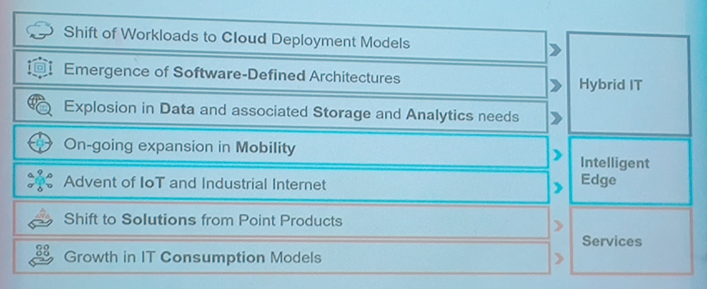

> Il y a deux types d'eleves:
> Les très bons et les très mauvais

*inserer video pub pour HP*

> Be the industry's leading provider of **hybrid IT**

#Les tendances de l'industrie IT

##In the Idea Economy, anyone can change the world
* Digital everything, everywhere, every day, everyone connected
* Every business is a digital business
* Disrupting every industry

Pas de problemes de:
* chaumage
* ressources

##We live in a world where everything computes
On arrive au meme niveau que le livre 1984, tout est surveille et calcule

##Digial transformation is disrupting every industry
###Transformed
* Video
* Books
* Magazine
###Transforming
* Healtchare
###Soon to be transformed
* Education

> A new generation of apps and data are the digital fuel

##Industry shifts continue to reshape enterprise IT

#Les metiers des technologies et du numerique
##Des secteurs d'activites
1. Constructeur
    * IBM
    * Dell
    * Apple
1. Editeurs
    * Microsoft
    * Oracle
    * Facebook
    * Google
1. Service
    * Accenture
    * Cap Gemini
    * Wavestone
1. Utilisateur
    * Axa
    * BNP Paribas
    * SFR
    * Michelin

##Des types de metiers
1. Techniques
    * Developpeur
    * Expert
    * Ingenieur systeme
1. Commercial
    * Ingenieur d'affaires
    * Responsable de compte
1. Organisationnel
    * Directeur informatique
    * Directeur de production
1. Pluriel
    * Architecte
    * Chef de projet
    * Consultant, auditeur
    * Business developpeur

##Domaines de l'informatique
1. Business
    * Accompagner la disruption
    * Creer de nouveaux "metiers"
    * Business et Technologie
1. Logiciel
    * Creer des nouvelles solutions au Datacenter comme a l'edge (IoT)
    * App Mobiles, Multimedia, IA, etc.
1. Infrastructure
    * Architectures
    * Management & reporting du Systeme d'information
    * Securite
1. Donnees
    * Donnees structurees (ou non)
    * Big data

##Pour quoi faire?
* Comprendre, Valider, Securiser
* Definir, Concevoir, Realiser
* Orchestrer, Animer, "leader"
* Creer, Innover, Inventer

#Et vous?
> A truly global company will be one that uses the intellect and resources of the world
