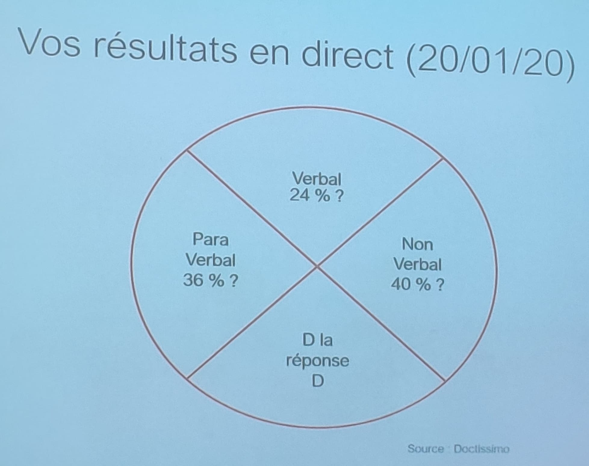
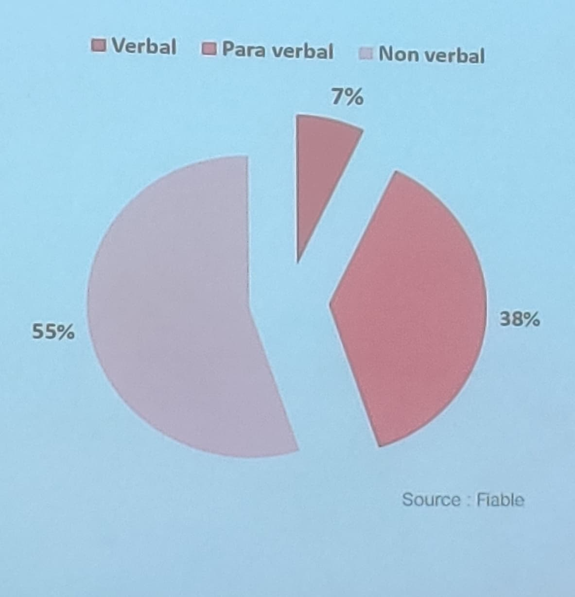

*But why encore une autre conference?*

# Les fruits de ses differentes experiences
* Experience de coach pour des adultes en reinsertion sociale
* Les retours sur les differentes soutenance de stage de fin de tronc commun
* Le regard sur le parcours en tant qu'ancien d'Epita
* (remplir des cases dans le planning)

# Les canaux sensoriels de communication
* Visuel
* Auditif
* Kinesthetique

# 3 differents langages
* le verbal
* le para verbal : le timbre de la voix, le volume, le rythme
* le non verbal : la posture, gestuelle, regard

*Quelle proportion?*

*La veritable repartition*

# Le para langage
## Le silence est d'or
Les silences font partie integrante de la communication

## Un oral est une chanson, une melodie
Le flus de parole dans une chanson n'est presque jamais le meme: le cerveay apprecie des variation de melodie

## Pour conclure
* Timbre de voix: assumer ce qu'on dit
* Volume de la voix : varier le colume
* Le rythme des mots : varier comme le volumme
* Les silences : arriver a se taire pour reflechir

# Les gestes et attitude
* La gestuelle : concerne les postures
* Les gestes qui sont des supports d'expressions

## Les gestes barriere
Si nous sommes mis en cause, interpelles, nous avons des gestes barrieres:
* Croiser les bras
* Se frotter les bras
* Remettre un habit en place

## Gestes conventionnels
On communique egalement avec des gestes conventionnels:
* Pointer du doigt vers la sortie
* Signe de la main pour dire au revoir
* Faire un doigt d'honneur
* Hocher de la tete pour dire oui

## Expressions faciales
* Expressions du visage qui expriment les emotions
* Certains mimiques peuvent accentuer le message ou le modifier (clin d'oeil, ...)

## L'espace et le langage "d'objet"
L'espace dans lequel la communication se deroule est codifie
    * l'espace est codifie
    * les apparences sont (malheureusement) codifiee
