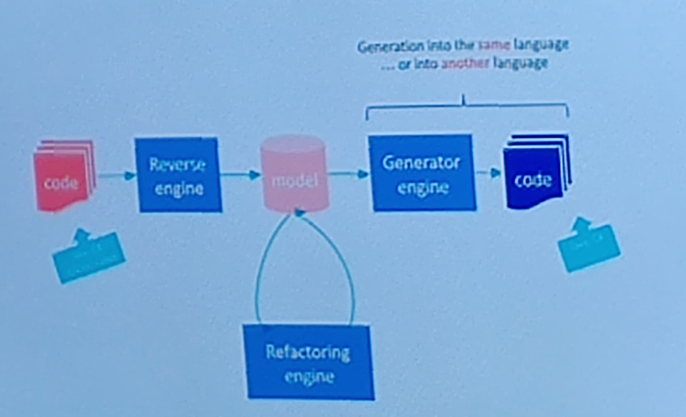
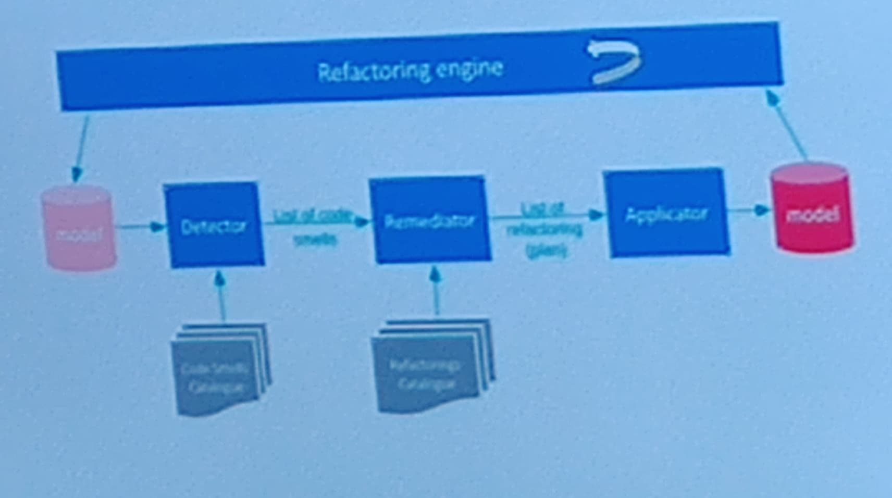
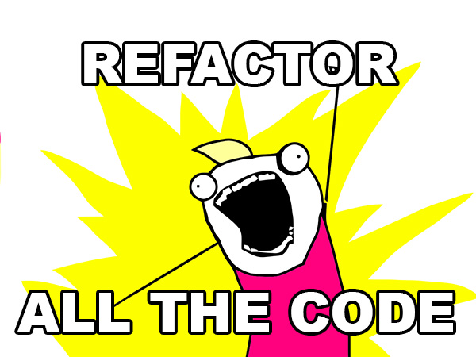

# Global process
Before applying smart algorithms, the source code must be **transformed** into a **model**

## Natural approach
* Treat code such as a **structure**, no interest in naming and comments
* Based on **programming language** elements
    * name of code entities
    * Comments, string content
* Reuse of **text mining** techniques

## Hybrid approach
**Bottom up process**
* Rely on the code structure

# Automatic refractoring
## Toolkit workflow

## Refractoring engine

# Machine learning is not that simple to apply
* Construction of training data is tricky
* Human subjectivity
* Open source vs corporate source
* Volume, access
* Code quality and technical depth is a real obstacle
* No revision history

# Deepomatic
Ne fait pas de reconnaissance faciale par choix

## Our platform: AI management
AI setup->Ai deployement->Ai exploitation

## Smart video survellance system: Indigo
* Real-time altering dashboard, used by remote
* Monitoring centers
* Alerts in case of violent behaviour
* People on the ground, robbery and obstruction of camera

## Animal behaviour analysis: Sanofi
* Automatic analisys of animal behaviour
* Filmed in their cage, to ensure compliance with animal welfare standards
