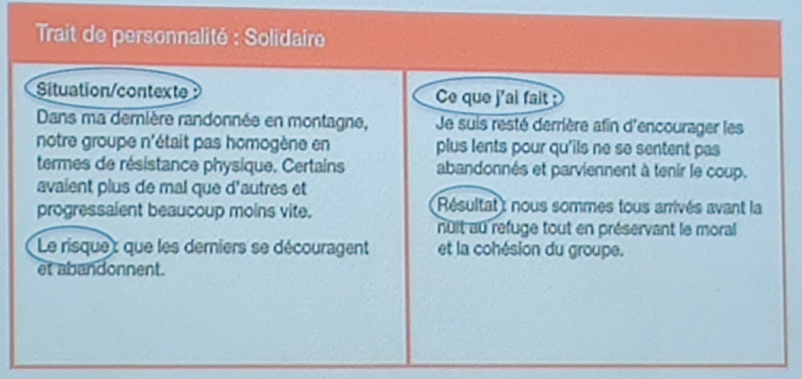

# Objectifs
1. Clarifier notre projet professionnel
1. Clarifiez notre CV et lettre de motivation
1. Nous vendre lors des entretiens d'embauche

# Clarifier notre projet professionnel
## Travail sur soi
1. Nos motivations, nos gouts, nos ambitions
1. Nos experiences (pro ou associatif)
1. Nos traits de personnalite

1. Regard des autres sur nous: 2 interview minimum
