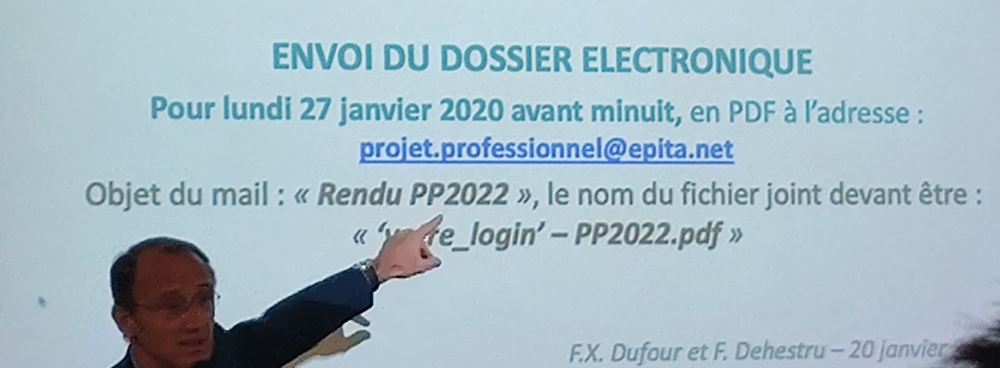
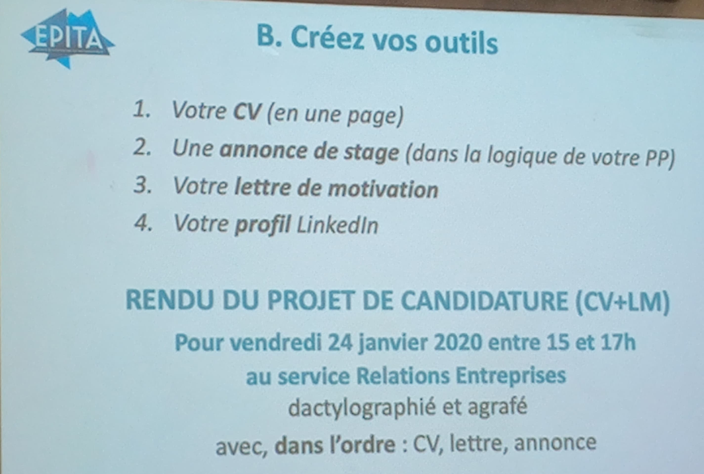

# Objectifs
1. Clarifier notre projet professionnel
1. Clarifiez notre CV et lettre de motivation
1. Nous vendre lors des entretiens d'embauche

# Clarifier notre projet professionnel

## Travail sur soi
1. Nos motivations, nos gouts, nos ambitions
1. Nos experiences (pro ou associatif)
1. Nos traits de personnalite

1. Regard des autres sur nous: 2 interview minimum
1. J'aime/j'aime pas
    * Ce que j'aime et que je sais faire
    * Ce que j'aime et que je ne sais pas faire
    * Ce que je n'aime pas mais que je sais faire
    * Ce que je n'aimerai pas faire et que je ne sais pas faire

## Travail sur les metiers et les entreprises
1. 2 metiers => dans 5 ans, soit 3 ans apres la sortie de l'ecole
1. Retenez l'un de ces 2 metiers
1. Indentifiez 5 entreprises (expliquez...)

## Organiser la mise en oeuvre de votre projet professionnel
1. Actions pour **obtenir un stage**
1. Les **personnes a contacter**

# Rendre son projet professionnel

