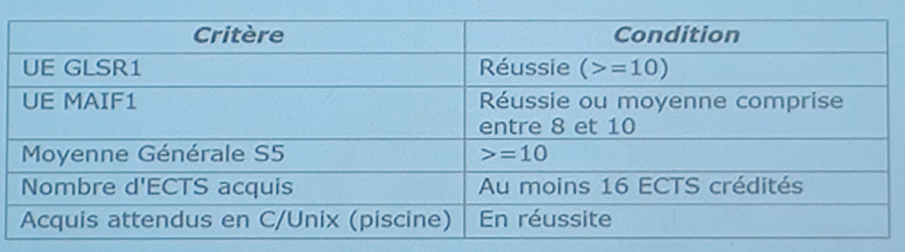

# Stages de fin de Tronc Commun

**Objectif du stage**
Ce stage technique doit permettre a nos etudiants:
* de s'integrer dans une equipe informatique
* de prendre conscience des imperatifs de conduite de projet
* de respect des delais dans le cadre de developpements significatifs

## Connaissances des etudiants
* A ce stade les etudiants ont acquis l'ensemble des connaissances de bases en informatique

## Duree et periode
1er septembre 2020 ou 7 septembre 2020 au 30 janvier 2021 (a etre confirme par mail)

**Date de reception des sujets** : du 15 avril au 15 juillet

La semaine du 31 aout au 5 septembre on risque d'etre convoaues a l'ecole si on a pas assiste aux soutenances des ing3 fin Juillet.
On doit assister a une soutenance de chaque majeure.

## Qui peut partir en stage ?
Les premieres autorisations sont donnees apres reception des notes du S5 et traitement par la direction des etudes (generalement fin mars)

Criteres et conditions de depart en stage de tronc commun:

