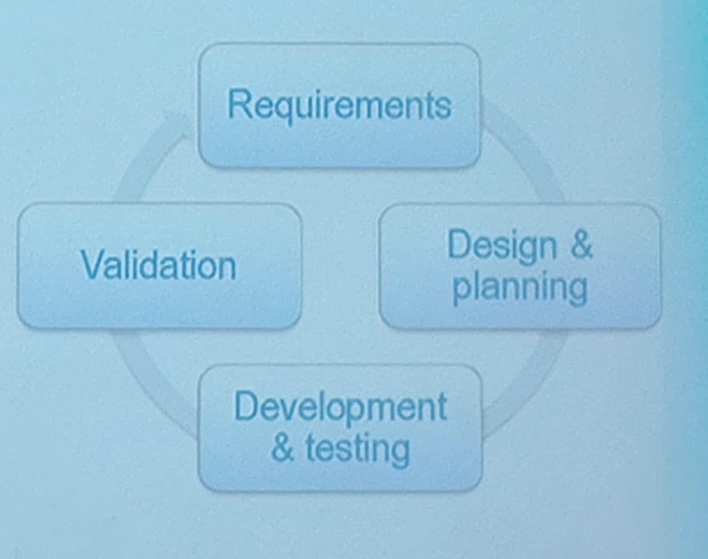

Synergie: campus entreprise (pas Synergie pour les madames)

# Table ronde "Metiers du Numerique"
* Thomas Boulanger:
    * ancien d'Epita
    * Travaille chez *Dassault Systemes*

# Dassault Systems *The 3D Experience Company*
* Modele 3D
    * Vehicules
    * Ville et immeubles
    * Terrain et geology
* Visualisation 3D de qualite en temps reel
* Simulation realiste
    * Materiaux
    * Phenomenes physiques (mechaniques, fluids, electromagnetisme, ...)
    * Systemes biologiques (molecules, reactions chimiques, ...)
* Business intelligence et "search-based applications"

## Sa carriere
* Epita (2009-2014)
    * YAKA, majeure SCIA
* Dassault Systemes
    * [C#] Graphical tools
    * [C++] Augmented Reality: virtually try clothes on
        * Kinect
    * [C++] Optimized visualization of massive mesh assemblies & PointClouds
        * GPU-based visibility computation
        * Levels of detail
    * [C++, Python] PointCloud semantic segmentation
        * Machine Learning
        * Data generation for training
## Life as an engineer in software development
* Development process
    * Spiral process with scheduled "gates"
    * Multiple levels of validation
        * individual -> team -> department -> production
* Collaboration
    * E-mails, calls, meetings
    * Brainstorming, code review
* Internal Marketing
    * Presentations, performance measurements, videos and demos
* Career
    * Professional training
    * Networking
    * Annual interviews (performance assesment + career aspirations)

## Relevant Epita Skills
* Mastery of programming
    * Languages (C#, C++)
    * Design Patterns
    * Parallel programming
* Advanced concepts
    * Graph theory
    * Machine Learning
* "Mind skills"
    * Adaptability
    * Logical thinking
    * Conscientiouness
